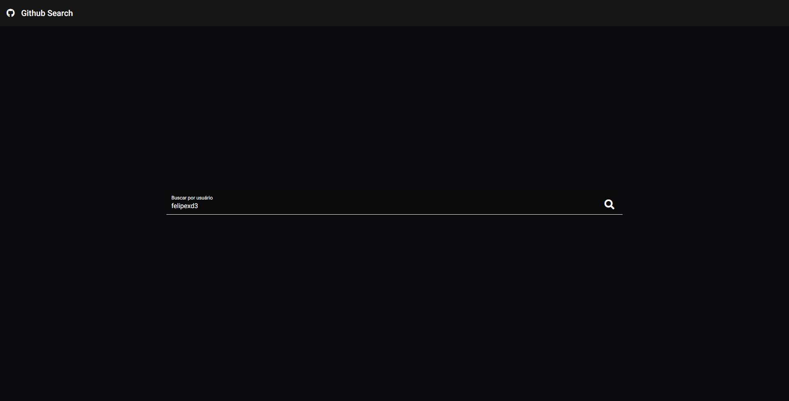
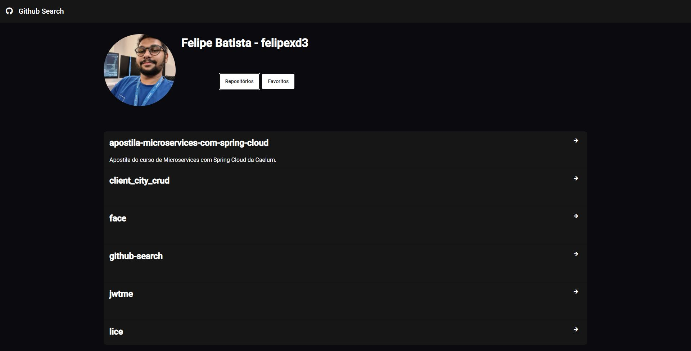
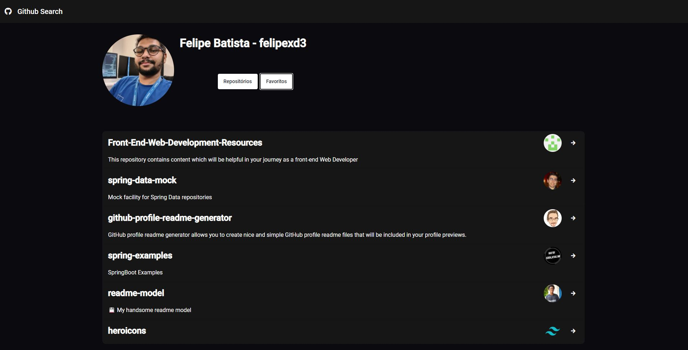

# Documentação

#### Descrição do projeto

Projeto desenvolvido para consumir a api do github para consulta de perfis, 
visualizar repositórios do usuário e repositórios favoritos.

#### O que é preciso para executar o projeto:

Para executar o projeto você precisará ter instalado e configurado:

- angular v8
- npm

#### Tecnologias Utilitizadas:

- Angular
- typescript
- Angular Material

#### Iniciando o projeto:

O projeto foi desenvolvido utilitizando o **Angular Universal** para realização do SSR.

    - Acesse o diretório do projeto à partir do cmd: ~ cd github-search
    - Execute o comando para instalar as dependencias: ~ npm install
    - Execute o comando para iniciar a aplicação: ~ npm run serve:ssr
    
#### Telas:

